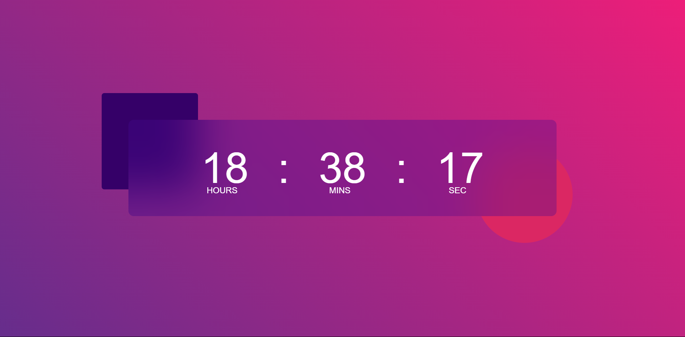

# digital-clock
This is a simple digital clock application created using HTML, CSS, and JavaScript.

## Features

- Displays current time in hours, minutes, and seconds.
- Responsive design that adjusts to different screen sizes.

## Screenshot

Here is a preview of the digital clock:

